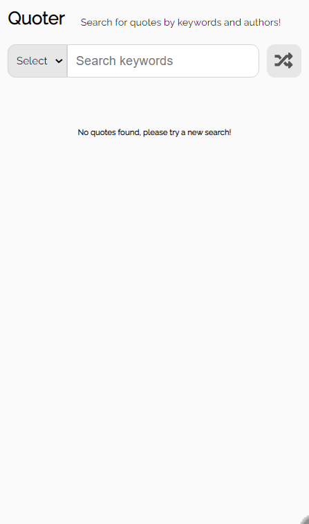
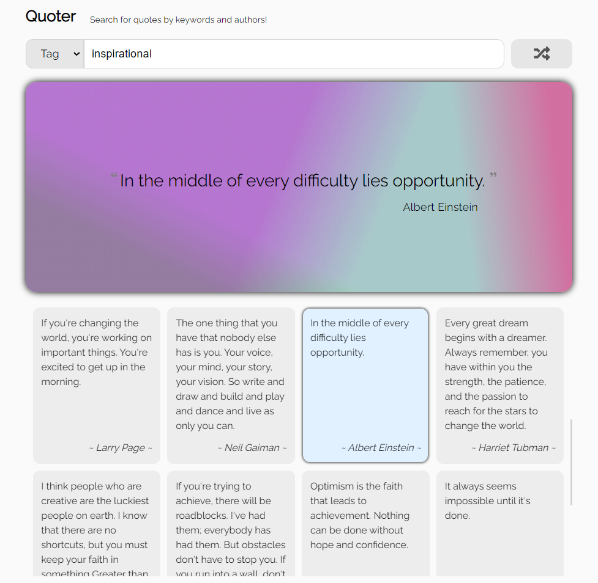

# quoter

[![Issues][issues-shield]][issues-url]
[![MIT License][license-shield]][license-url]
[![LinkedIn][linkedin-shield]][linkedin-url]

<!-- PROJECT LOGO -->
 

<h3 align="center">quoter</h3>
 
  

    A responsive famous quote lookup app built with React
     
    <a href="https://quoter-react-app.netlify.app/">View Demo</a>
    ·
    <a href="https://github.com/mike-uffelman/quoter-react-practice/issues">Report Bug</a>
    ·
    <a href="https://github.com/mike-uffelman/quoter-react-practice/issues">Request Feature</a>
  

 

<!-- TABLE OF CONTENTS -->

## Table of Contents

  
Quoter App

  <ol>
    <li>
      <a href="#about-the-project">About The Project</a>
      <ul>
        <li><a href="#react-features">React Features</a></li>
        <li><a href="#api">API</a></li>
        <li><a href="#additional-features">Additional Features</a></li>
      </ul>
    </li>
    <li><a href="#demo">Demo</a></li>
    <li><a href="#built-with">Build With</a></li>
    <li><a href="#getting-started">Getting Started</a></li>
    <li><a href="#license">License</a></li>
    <li><a href="#contact">Contact</a></li>
  </ol>

 
<!-- ABOUT THE PROJECT -->

## About The Project

This is a small quote lookup application built with the React.js library. The primary scope of this project is to showcase and practice the React basics in a small class based application. The application focuses on and features the usage of stateful components, i.e. as the user interacts with and makes changes to the components, the components will rerender reflecting the state change according to the logic built into the component.

### React Features

Additional features and concepts within the application include:

- **JSX** - templating markup with logic, returned from each component for rendering in the browser
- **state** - components state variables housed and maintained component specific data, e.g. an array of quotes to be rendered and a selected quote to display in the showcase
- **props** - for passing state variables and callback functions to child variables for additional processing or to lift state up to the parent component
- **refs** - refs are used in this application to access the background-image property of the quote showcase, everytime a quote is displayed in the showcase a new linear-gradient background image is generated and added to the element
- **lists** - retrieved quotes from an API call are mapped over and returned as a JSX list item and rendered in the browser
- **event handling** - React specific events (e.g. onSubmit, onChange, onClick) within the JSX are used to handle user events which then execute a callback function for further processing
- **controlled components** - ensures the state keeps and maintains all information about the component for processing and rendering, as opposed to uncontrolled where the information would have to be accessed through the HTML (e.g. document.querySelector)

### API

The **[Quotable API](https://github.com/lukePeavey/quotable#list-quotes)** is the source used for retrieving user searches.

- "/tags" and "/authors" are the currently implemented endpoints for calls to the API, and will return a list of quotes for the user to select and display in the showcase.

### Additional Features

- flexbox and grid css styling and layout
- Linear gradient generator to apply background-image to the showcase quotes

(<a href="#quoter">back to top</a>)

 

## Demo

(<a href="#quoter">back to top</a>)

 

## Built With

| Technology Stack                                               | Description       |
| -------------------------------------------------------------- | ----------------- |
| JavaScript                                                     |                   |
| [reactjs](https://reactjs.org/)                                | front-end library |
| [quotable](https://github.com/lukePeavey/quotable#list-quotes) | quote API lookup  |

(<a href="#quoter">back to top</a>)

<!-- GETTING STARTED -->

## Getting Started

Open the [live demo here](https://quoter-react-app.netlify.app/).

(<a href="#quoter">back to top</a>)

<!-- LICENSE -->

## License

Distributed under the MIT License. See `LICENSE.txt` for more information.

(<a href="#quoter">back to top</a>)

<!-- CONTACT -->

## Contact

[![LinkedIn][linkedin-shield]][linkedin-url]
[![GitHub][github-shield]][github-url]
[![Project][project-shield]][project-repo]

(<a href="#quoter">back to top</a>)

[issues-shield]: https://img.shields.io/github/issues/mike-uffelman/quoter-react-practice.svg?labelcolor=green
[issues-url]: https://github.com/mike-uffelman/quoter-react-practice/issues
[license-shield]: https://img.shields.io/github/license/mike-uffelman/quoter-react-practice.svg
[license-url]: https://github.com/mike-uffelman/quoter-react-practice/blob/master/LICENSE.txt
[linkedin-shield]: https://img.shields.io/badge/LinkedIn-profile-blue
[linkedin-url]: https://www.linkedin.com/in/michael-uffelman-34289521/
[github-url]: https://github.com/mike-uffelman
[github-shield]: https://img.shields.io/badge/GitHub-profle-orange
[project-shield]: https://img.shields.io/badge/GitHub-repo-gray?color=#6cc644
[project-repo]: https://github.com/mike-uffelman/quoter-react-practice
[quote-demo]: ./public/images/quote_demo2.gif
[quote-desktop]: ./public/images/quote_desktop1.png
